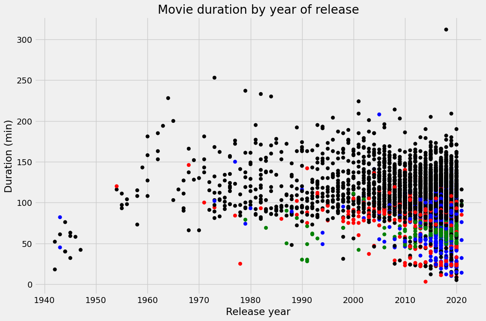

# Netflix Movies Data Analysis

## Overview

This Jupyter Notebook provides a detailed analysis of Netflix movies, utilizing Python libraries like Pandas and Matplotlib to read, clean, and visualize movie data. The analysis includes filtering data to focus on movies, plotting movie durations against their release years, and categorizing them by genre.

## Features

- **Data Extraction**: Importing movie data from a CSV file into a Pandas DataFrame.
- **Data Filtering**: Creating subsets of the DataFrame to analyze movies by title, country, genre, release year, and duration.
- **Visualization**: Generating scatter plots to visualize the duration of movies over the years and analyzing genre distribution using color coding.

## Inferences from the Analysis

- **Movie Duration Trends**: Most movies have a duration ranging approximately between 75 and 125 minutes, aligning with the standard length for feature films.
- **Historical Variation**: A significant variance in movie duration is evident, especially from the 1940s to the 1970s, suggesting that films during those years had more diverse lengths.
- **Recent Trends**: There is a trend towards standardization in movie lengths in recent years, with a concentration of durations between 90 to 120 minutes.
- **Color Coding by Genre**: The analysis shows a smaller proportion of children's movies and stand-up comedy specials compared to documentaries and other genres. Documentaries are evenly distributed across the years and vary in duration, while stand-up specials are generally shorter and more recent.
- **Data Distribution Over Time**: An increase in the number of movies (indicated by black dots for other genres) in recent years suggests growth in the volume of Netflix's movie catalog.
- **Short Movies**: Films under 60 minutes are present, which may be either short films or miscategorized TV content.
- **Long Duration Films**: A presence of films over 200 minutes, particularly in recent times, points to extended cuts or longer feature films.

## Usage

To use this notebook:

1. Ensure you have Python installed along with the Pandas and Matplotlib libraries.
2. Place the dataset `netflix_data.csv` in the same directory as the notebook or adjust the file path in the code.
3. Execute each cell in sequence to perform the analysis and view the visualizations.

## Intended Audience

The notebook is meant for data analysts, data science enthusiasts, and anyone interested in Netflix's content trends. A fundamental understanding of Python and data analysis concepts is beneficial.
